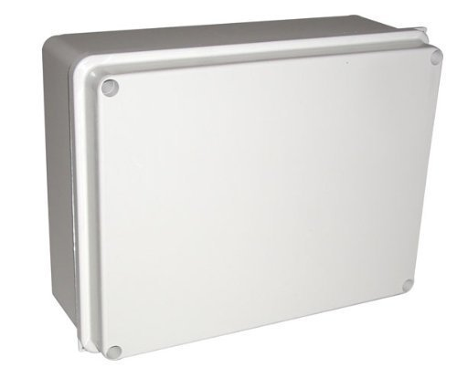
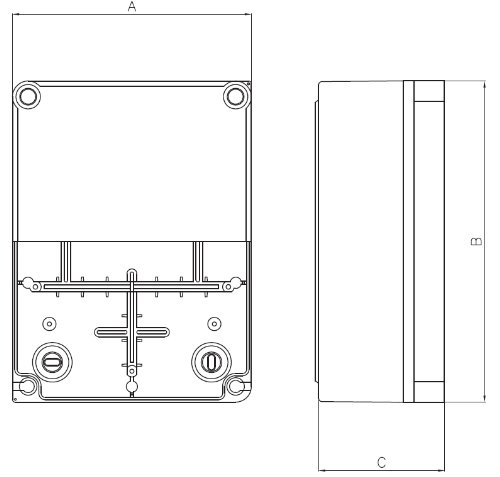

=================
Resource planning
=================

The watering sensor node WASENO is going to need an embedded platform, some
kind of actuator to turn water on and off, any number of sensors to determine
when to actuate, an electric energy source to power the whole thing, and
a housing, to keep everything dry and protected.

.. contents::
   :local:
   :backlinks: top

-------------------------------------------------------------------------------
Hardware parts
-------------------------------------------------------------------------------

~~~~~~~~~~~~~~~~~
Embedded platform
~~~~~~~~~~~~~~~~~

For an embedded platform, we had a few requirements that pointed us in
the Intel Edison's direction:

- measure soil moisture, keep time, and activate actuators.
- expose a RESTful interface to the sensor node, to query sensor data,
  status log and allow manual override.
- connect with the internet using some kind of wireless technology.

The edison might be a bit overkill with it's dual core application processor,
but having an application processor coupled with a microcontroller and the
wifi+bluetooth radio makes this an obvious choice. For prototyping purposes,
the edison with the arduino compatible breakout board is going to be perfect.

This will cost 100 euros by itself. However the Edison module alone will cost
around 50 euros, and there are cheaper breakout boards once we are done
prototyping.

~~~~~~~~
Actuator
~~~~~~~~

The edison board should turn on and off the water flow using some kind of
actuator. Being already familiar with solenoid valves, that's what we will
be using here.

We picked a solenoid valve with ``3/4 inch`` inlet, and 4 ``3/8 inch`` outlets.
So it's basically 4 NC (normally closed) solenoid valves rated at
``12V, 440mA``, that share the water input line like the one you probably have
in your washing machine.

The cost for the actuator we picked was around 30 euros, which is 7.5 euros
per solenoid valve outlet.

In the future, we might move to other actuating solutions if we find
something more suitable, but the general idea will always be the same:
use electricity to control some kind of water valve, turning it on and off
according to the need.

~~~~~~~
Sensors
~~~~~~~

A soil moisture sensor allows WASENO to water plants when the soil is too
dry to sustain plant life, but also to save water by not watering
when it rains for instance.

Ideally the moisture sensor would use a combination of capacitance and
resistance to measure soil moisture.

The problem with resistance is that even a change in fertilizing technique
would influence the soil's electric resistance, hence the constant need to
calibrate the sensor.

In addition to that, measuring resistance requires passing current between
the probe's leads. If the probe leads are made out of some kind of metal,
that tends to leach into the soil with time, which might be undesirable.

The soil's electric resistance also changes with temperature, which means
that in addition to measuring resistance, we would have to measure soil
temperature to figure out how to compensate value shifts in the final
moisture measurement.

Using soil capacitance, one tends to get better results, with less
variables and calibration to worry about.

We also plan to use water flow sensors to measure the water requirements
of each garden section, or plant. This can help us detect any problems with
the different sensors, when either the moisture sensor or flow sensor
malfunctions, a manual override from the user can be required until the
system can be debugged and the inconsistency dealt with.

~~~~~~~~~~~~~
Energy Source
~~~~~~~~~~~~~

When installing an automated irrigation or watering system, installing extra
electrical installation can be one of deal breakers. On top of the water
installation, you would need extra wires to deliver power to valves
and sensors.

To make it possible for our watering sensor nodes to be truly modular and
decoupled from electrical installation restraints, we thought we would
use a small solar panel coupled to a lithium battery to meet the energy
requirements of a sensor node.

The embedded platform needs to be powered up, and consumes less than ``1W``.
The biggest energy requirement is that of the solenoid valves consuming
``5.28W`` per solenoid. That puts the peak consumption at ``22W`` if we activate
all 4 solenoids at once.

However if we program our :term:`MCU` to activate one solenoid at a time,
we can reduce peak power requirement to ``6W``.

With a ``14,8V`` li-ion battery pack ``(4*3.7V)``, and a ``12V``, ``5W``
solar panel, we should be able to power a watering node.

The arduino breakout board can be directly powered by the pack, since the DC
power jack is rated at ``7V–15V`` DC input.

We will try to reduce power consumption with each iteration of the project.
If there are ways to reduce power consumption, it would be by chosing more
energy efficient water valve actuators to do so.

~~~~~~~
Housing
~~~~~~~

For the housing, we know that water and electricity mix badly. We want to
keep the electronic components dry. However every component -- including our
actuator -- is electrical. The housing, or enclosure we choose needs to be
watertight.

Having a watertight enclosure is not enough, as our actuator has water passing
through, and is connected to the outside of the box, through some sort of
plumbing we will tackle later.

We could pretend that careful design and planning of the internal plumbing
can minimize the chance of any leak, but there will always be a chance.
And when things can go bad, they eventually do.

In the beginning, to simplify the first few iterations of the project, we
will pretend that *Murphy's law* does not apply to our project. In other words,
we only need to protect against the outside environment.

However before deploying WASENO in the garden physically, we will figure out
a way to protect the internal electronics from any internal leaks
(i.e. when Murphy's law catches up).

In order to meet our requirements, we decided to go with an electrical
industrial enclosure, that seals watertight. IP65 rated enclosures seem to be
suitable, although an IP66 rating would have been slightly better. Any rating
over IP66 will definitely be overkill, since we won't be plunging the project
box in a meter deep water container.

We went with the JS7680 electrical industrial enclosure rated at IP65 that's
designed for outdoor applications. It's made out of ABS UV-resistant plastic
with a lid that gets secured using 4 stainless steel screws.

Physical
========

:Colour: grey (RAL 7035).
:Material: UV-protected ABS housing and cover with stainless steel screws
:Dimensions: width (B) 240 mm; height (A) 190 mm; depth (C) 110mm

Ratings
=======

:Temperature rating: -15 °C to +60 °C according to DIN EN 60670
:Temp. Tolerance: up to 70°C max according to DIN EN 60695-10-2
:Autoignition temp.: starts at 650°C according to DIN EN 60695-2-11
:Ingress Protection: IP65 protection according to IEC 60529 / DIN 40050.

This enclosure will be used for the first few iterations since it's priced
reasonably at 16 euros delivered to your door. This might change if our
requirements change.

-------------------------------------------------------------------------------
Administration
-------------------------------------------------------------------------------

A mobile application will be developped to showcase/demo the watering sensor
node. Given the RESTful interface exposed on our sensor node, designing
an administration dashboard is relatively straight-forward. Being already
familiar with python, we'll probably use that in the begining.

The node.js support is however very tempting. It has the big advantage to
write for instance the server and client side of our web app in one
language.

-------------------------------------------------------------------------------
Cost
-------------------------------------------------------------------------------

We mentioned deal breakers earlier. One very valid deal breaker is cost.
An effort was made to try and stay below 100 euros per 4 garden regions or
plants.

We already are over budget, maybe we can find cost reductions in future
iterations. For instance we could move to a cheaper breakout board,
find a more energy efficient and cheaper valve solution.
