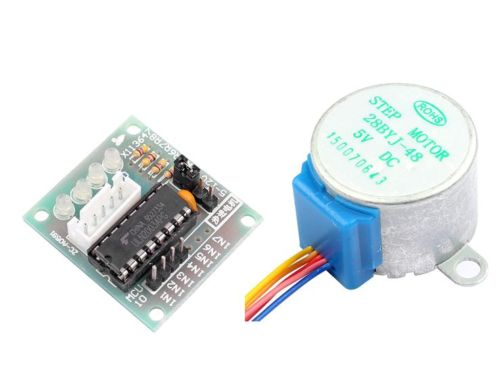
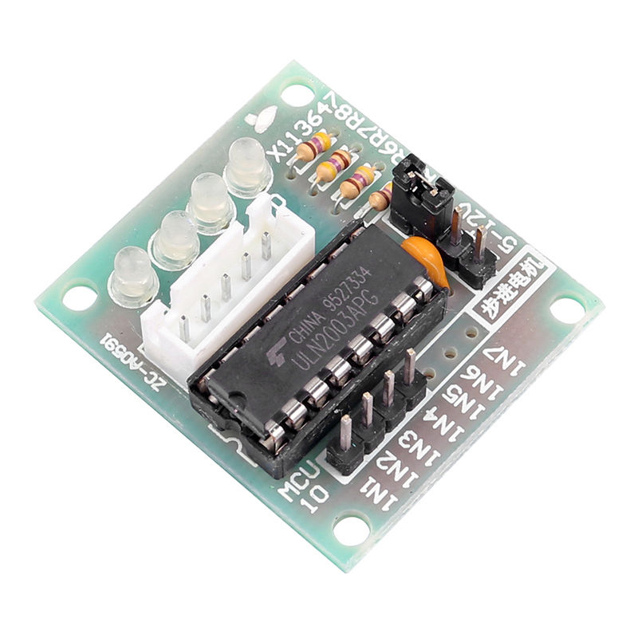

=============
WASNO, Mark 1
=============

During the development planning, we ordered the list of tasks according
to the risk in terms of competence.

However for this project to be successful, at the end of the first iteration,
it is paramount to be able to connect the WASENO to a water line, and be able
to control four water outputs independently from the internet. So the tasks
in order of importance to accomplish our goal, will be:

- To figure out a way to connect/attach the input and outputs of the solenoid
  to the enclosure (does not have to be perfect, can be improved in the next
  iteration)
- Have an edison fit in the enclosure.
- Find a driver board for the solenoid valves.
- Power the whole with a battery pack.

.. contents::
   :local:
   :backlinks: top

-------------------------------------------------------------------------------
Plumbing
-------------------------------------------------------------------------------

Taking care of attaching the solenoid valve aggregate input to the enclosure
seems relatively simple. The water input is a threaded ``3/4 inch`` with ``M4``
screw holes on either sides. The distance between the center of each hole
is ``45mm``.

The water output is a different story. It's a ``3/8 inch`` barbed hose fitting.
Connecting those to the enclosure to expose it to the outside was the hardest
to figure out, and we are not certain our solution is adequate. For future
iterations, we'll ask a professional plumber for advice.

But for now, we exposed the outputs to the outside using ``3/4 inch``
male-to-female threaded extension fittings on the outside of the enclosure,
and ``3/4 inch`` threaded female to ``3/8 inch`` hose fittings inside
the enclosure.

We then connected the valves aggregate outlets to the enclosure's hose fittings
using nylon hoses.

.. note:: we went with a nylon hose because it was available cheaply at the
   hardware store, but for future iterations we will go with either silicone,
   or a regular reinforced garden hose for the internal plumbing connections.

The holes were drilled using a ``3/4 inch`` wood holesaw drill bit using
a drill press. For the screws, we used a ``4mm`` drill bit for the screw
holes.

Every fitting was secured using seals to keep water from leaking. Even the
screws securing the valves aggregate to the enclosure were tightened through
rubber seals.

-------------------------------------------------------------------------------
Hardware
-------------------------------------------------------------------------------

~~~~~~~~~~~~~~
Solenoid valve
~~~~~~~~~~~~~~

The solenoid valves aggregate we picked for our project is rated at ``12V,
450mA``. After a few hours at the makerspace in Vienna (Maker Vienna), I was
able to measure the current drawn from each solenoid, using a bench PSU and
ampmeter. The result was ``440mA`` current draw, so maybe ``450mA`` is the
peak current used.

In any case, an embedded platform's gpio is rated only for signaling,
the voltage at the pins is rarely over 5V, and little current can be drawn
from the pins.

However the signaling from the ``gpio`` can drive some sort of transistor
to amplify the power for use in things like motors and solenoids. This reminded
us of a cheap chinese made stepper motor sold to beginners for use with
the arduino. As it happens, we had a few at hand.

It can be found online by searching for ``28BYJ-48``:

    28BYJ-48 Stepper and Driver

Now the reason why this is relevant, is the controller board that comes with
the stepper motor. It's based on the classic ULN2003 7-channel darlington
array:

   The ULN2003 based 28BYJ-48 driver.

The collector-current rating of a single Darlington pair is ``500mA``, and the
voltage output is rated at ``50V``.

This makes it perfect for our application, although we will only need 4
channels to drive the solenoid valve aggregate.

We did not want to cut the stepper motor cable, because we can still use it
as is. Instead we went and asked in our local Conrad shop, where they could
not find an extact match, but they had something very close in stock.

So we desoldered the connector from the driver board, and soldered the one
we bought:

Now when trying to open a circuit involving an inductor, you always have
back emf you need to protect against with for instance a flyback diode.
According to the specs of the **ULN2003**, it already has output clamp diodes,
which is another word for a flyback diode, but some of the wording in the spec,
and some online comments left us to believe that it's better to be safe, and
added a ``1N4001`` between each channel output and common ground connector.

The edison

-------------------------------------------------------------------------------
Software
-------------------------------------------------------------------------------

Bottle framework
